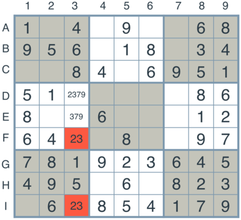

## Udacity - Artificial Intelligence Nanodegree - nd889

# Solve a Sudoku with AI

As discussed in Chapter 6 of Artificial Intelligence: A Modern Approach, constraint satisfaction problems can be described using three components, Variables X, Domains D and Constraints C.

Sudoku is a puzzle which can be described as a CSP with 81 variables X arranged in a square with rows A -> I and columns 1 -> 9, each variable comprised of the domain D { 1 ... 9 }.

There are 27 different units comprised of every combination of rows, columns or 3x3 quadrants starting from the top left. Each unit provides an Alldiff constraint C where each unit must contain only one of each value from the domain set.

In addition in diagonal sudoku both 9 long diagonals of the square, form an additional two units with the same Alldiff constraint.

Sudoku squares also come with some values prefilled as additional constraints which provide a starting point for solving the puzzle.

# Question 1 (Naked Twins)
Q: How do we use constraint propagation to solve the naked twins problem?

A: Due to the Alldiff constraint of a given unit we can consider this in terms of the Pigeonhole Principle.

In the Pigeonhole Principle a set of n pigeons are put into n pigeonholes, so there can't be more than n pigeons in all of the pigeonholes. Additionally if the n pigeonholes can only hold n pigeons then the pigeons cannot be anywhere else.

If there are n + 1 pigeons then one of the n pigeonholes must hold more than 1 pigeon, however in Sudoku a pigeonhole cannot hold more than 1 pigeon.

More specifically in Sudoku where a single unit's 9 boxes can only hold digits from the domain D of { 1 ... 9 } and each digit must be unique, if n of those boxes contains n different digits then those digits cannot be in any other boxes in the unit and so they can be removed as possibilities from neighbouring boxes.

In the naked twins strategy this works by identifying two boxes in the same unit which contain the same two digits. The constraint says that each box must contain a digit, and because each box can only contain one of the two digits, this precludes the digit from any other box in the unit and they can be removed.

By propagating this constraint that a set of n values in n squares within a unit precludes those values in other boxes, through the entire set of units we can eliminate a lot of uncertainty.

The same principle applies in triplets and quads, however in those instances only one box needs n digits, the others may simply be a subset of those digits as long as they are not already solved.

For example: 127 27 17 forms a naked triple and 1274 127 74 14 forms a naked quad.

# Question 2 (Diagonal Sudoku)
Q: How do we use constraint propagation to solve the diagonal sudoku problem?

A: The diagonals form two additional units which have the same values, domains and constraints as all of the other units in the normal grid and do not violate any of the existing constraints. Therefore to solve with diagonals we simply add the diagonal units to the constraints of the the problem and propagate our strategies such as eliminate, only once and naked twins through these units as well.
