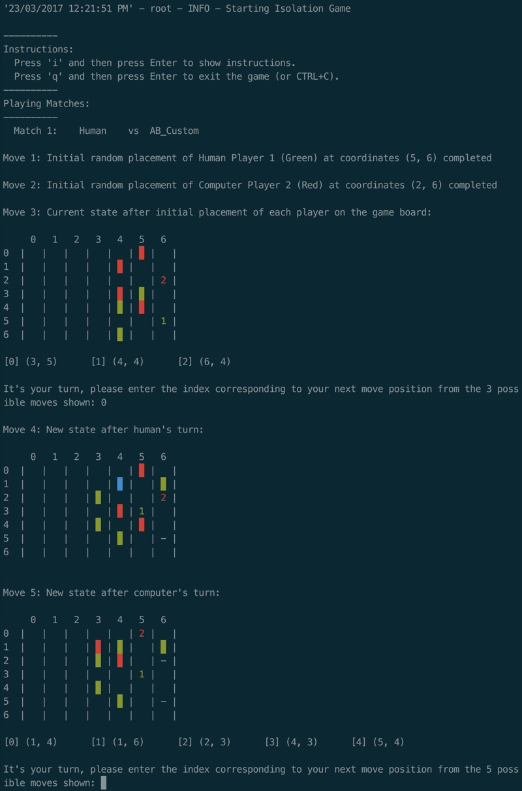

## Udacity - Artificial Intelligence Nanodegree - nd889

# Build a Game-Playing Agent

For the AIND Project 2: Build a Game-Playing Agent, we were introduced to the game Isolation and the concepts of Minimax tree search and Alpha-Beta pruning.

In addition we were asked to develop our own heuristics to attempt to beat the supplied heuristics. This was more difficult than expected and illustrated the tradeoff between a heuristic complexity and speed when used for tree search.

## Game UI ♞
I made some changes to the Game UI to allow board numbering, player colors and visual display of possible moves. Thanks to [@ltfschoen](https://
github.com/ltfschoen) for contributions. 😎

## Instructions

* Play against AI:
```bash
$ python play.py
```

* Run tests:
```bash
$ pytest
```

* Run genetic algorithm:
```bash
$ python pit.py
```

## Additional Material

1. [Heuristics Analysis](heuristic_analysis.md)

2. [Research Review](research_review.md)

---

## Screenshot



