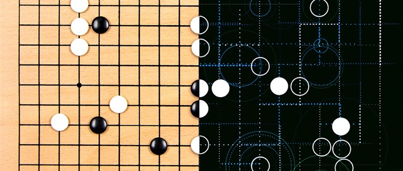
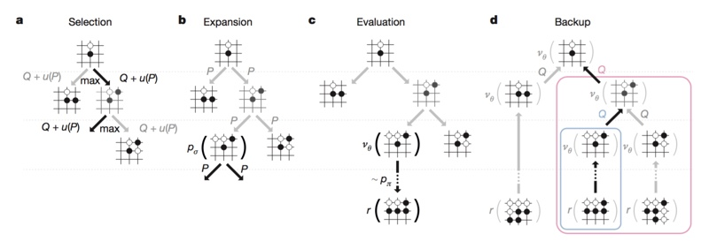
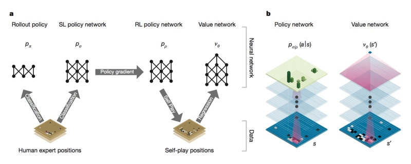
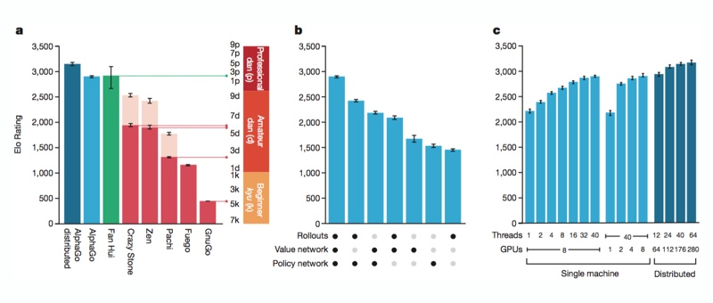
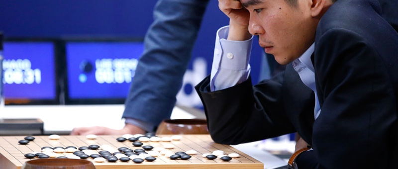

## Udacity - Artificial Intelligence Nanodegree - nd889

# Research Review - AlphaGo

For my review I have chosen the paper by Google DeepMind ["Mastering the game of Go with deep neural networks and tree search"](https://storage.googleapis.com/deepmind-media/alphago/AlphaGoNaturePaper.pdf
).

### Chess and Deep Blue

If you were interested in chess or computing in the late 90's you probably know of the famous match where IBM's Deep Blue defeated the then reigning world champion Gary Kasparov in chess.

What Deep Blue did to demonstrate the power of first wave AI over a human in a game that for over a millennia has captivated the greatest minds in the west; AlphaGo has now done for second wave AI, in a revered eastern game called Go.

Until AlphaGo, computer scientists had believed creating an AI capable of superhuman performance in go was at least ten years away. Why has it taken nearly twenty years since Deep Blue, for an AI to beat a human expert at the game of go?

### The Problem

Go, like chess is a perfect information game in which two players, take alternating turns placing valid moves on the board. The game ends when a terminal board state is reached such as checkmate in chess, or two consecutive passes in the case of go.

In theory for any given board state there is an optimal move for either player which may result in that player winning. For simpler games the outcome can be proven, where every single permutation of moves is mapped out to its terminus.

If we consider a tree of all possible moves for the game of chess where the average branching factor at each turn is approximately 35 and the average ply (depth) of games is 80, the number of nodes to search in the tree would be 3580 or 10123. Even Claude Shannon’s famous Shannon number tells us a conservative lower bound of the game tree complexity of chess is 10120. Therefore solving chess in a timed competitive scenario with a brute force tree search is not feasible.

However Deep Blue was able to achieve superhuman performance and defeat Kasparov in a time limited tournament by reducing the search space using a combination of Minimax with Alpha-beta pruning and human tailored heuristics for evaluating board states. It's important to note that even Deep Blue was still averaging a search depth of only six to eight moves per turn occasionally hitting a maximum of twenty.

So why can't we just apply Minimax with Alpha-beta pruning and some clever heuristics to go? While Alpha-beta pruning can help with the depth, looking at the numbers we see that go has an average branching factor of 250 and an average game depth of 150 putting its game tree complexity at 10359. With those figures the search space is intractable. Even taking into account more modern computing power it's unlikely this approach would provide more than a few moves of ply depth and would fail to beat even beginner go players.

Clearly an alternative solution to reducing the game tree complexity is required.

### An alternative to Minimax

In their paper, Google DeepMind talks about the previous state of the art go programs which utilize a technique called MCTS or Monte Carlo Tree Search.

MCTS is a tree search with policies to guide the AI towards certain moves, however rather than a heuristic evaluation function to determine what to do at a node where the policy cannot decide; the Monte Carlo (random sampling) aspect explores beyond this node with simulations.

Using a rapid rollout policy a fraction of the possible branches are played out to their terminus and the results are combined into an estimated Q value and used further up the tree in the next pass. Over time the results of these simulated estimates trend towards accurate approximates.

This provides a possible answer to the branching factor problem, by greatly reducing the number of branches visited during a search. The use of MCTS alone has provided state of the art solutions for other board games and amateur dan level play for the game of go, an impressive feat in itself.

### Towards Superhuman Performance

Though they do not explicitly mention, it would seem that Google DeepMind decided to start with the state of the art, Monte Carlo Tree Search and find a way to improve the policy and evaluation aspects using deep neural networks.

If you think about what a human does when playing these kinds of games, they will often look at various possible moves in their head, looking deeper at branches which appear more promising, while leveraging their prior gaming experience to quickly and intuitively discard possibly poor moves and prioritize their time on quality moves instead.

While Deep Blue could sometimes explore deeper than Kasparov, in go an AI that cannot ignore most of the poor quality moves the way humans do instinctively, would get stuck behind a very short move horizon.

Due to the game complexity hand crafting a policy for expert moves is not feasible nor would it generalise to potential unknown underlying mechanisms of the game.

Instead DeepMind turned to deep neural networks to both help estimate a value function which given a board state can determine its expertness; and build policy networks to select promising moves for further search.

A solution which, in the words of DeepMind seeks “to reduce the effective depth and breadth of the search tree”.

By cleverly repurposing breakthroughs in computer vision, AlphaGo utilizes a deep neural network which treats the go board as a 19 x 19 image where each square or stone is a pixel.

This network is then trained with a special pipeline of supervised and reinforcement training.
<!--- PDF Formatting
 
 
 
-->
### Architecture

First, a 13 layer deep neural network called the SL (Supervised Learning) policy network, made from convolutional layers with weights and nonlinear rectifiers is trained on 30 million board states from the KGS Go Server.

A softmax output layer gives a probability distribution over all legal moves. This network’s expert move prediction accuracy is 57% which beats the previous state of the art of 44.4%. DeepMind notes that small improvements in this accuracy result in large improvements in playing strength of the AI.

In addition a faster less accurate rollout policy network is trained for use during Monte Carlo rollouts, where a sample of branches for a selected node are simulated to terminus.

While the rollout policy network is only 24.2% accurate at determining an expert move, it does so in 2 microseconds, 1,500 times faster than the SL policy network. For rollouts, accuracy is traded for a faster policy network that will be run many times more than the SL policy network during MCTS. The closer approximation from many more Monte Carlo simulations in the same time easily makes up for the inaccuracy tradeoff.

Second, to improve the SL policy network, a nearly identical neural network called the RL (Reinforcement Learning) policy network is initialized with the same weights as the SL policy network and then matched against random previous versions of itself to prevent overfitting and further generalize the weights of the SL policy network.

Weights are then updated in the SL Policy network using stochastic gradient ascent to maximize expected outcome.

When the RL policy network was matched against the SL policy network it normally won 80% of games. Additionally without search the RL policy network alone was able to beat the open source Monte Carlo Tree Search based go AI, Pachi 85% of the time.

Interestingly DeepMind found through testing that the optimal number of convolution filters in the RL policy network was 256, when compared with 128, 192, 384.

Finally, DeepMind attempts to approximate a value function for any given board state by creating a value network of weights. The value network is similar to the policy network but outputs a single win or lose prediction, rather than returning a probability distribution.

To reduce overfitting of game prediction from the original human games, the data set was changed to consist of 30 million unique board states sampled from different real games and each board state was played until terminus. Once trained, a single evaluation of the value network approached the accuracy of Monte Carlo rollouts with the RL policy network, but with 15,000 times less computing power.

Interestingly, while the SL policy network outperformed the RL policy network, the value function approximated from the RL policy network performed better than one derived from the SL policy network.

### The Ensemble

When the MCTS rollouts, value and policy networks were tested independently or in combination, it was found that they were always superior when used together as ensembles; which suggests the two different position evaluation mechanisms are complementary.

The value network quickly approximates the strong but slow policy network, while the rollouts accurately score simulations played by the fast weak rollout policy.

The final AlphaGo is a combination of MCTS and the policy and value networks which determines actions by searching the tree. Leaf nodes are evaluated in two ways, first by the value network and second by a random MC rollout played until terminus with the fast rollout policy.

After simulation the action values and visit counts of all visited edges are updated, finally from the root position the algorithm selects the move with the most visits.

<!--- PDF Formatting
 
 
 
-->
### Results

The result is a new search algorithm that uses Monte Carlo Simulation, combined with value and policy deep neural networks to achieve superhuman performance working in an intractable search space.

The AlphaGo implementation uses a parallel asynchronous non-locking combined CPU and GPU architecture which scales.

AlphaGo sports a 99.8% win rate against other go programs and most dramatically defeated the current world champion of go, Lee Sedol 4 - 1. Against Fan Hui, the european champion of go, AlphaGo evaluated thousands of times less moves than Deep Blue did in chess against Kasparov. This demonstrates that the policy network can choose more intelligent moves while evaluating them more accurately using the value network.

Most profoundly, AlphaGo's evaluation function was learned from supervised learning of real gameplay and reinforced with self-play in stark contrast with the hand crafted heuristics used in Deep Blue.

AlphaGo is a historic human achievement in the endeavour to develop increasingly complex and superhuman capable AI.
