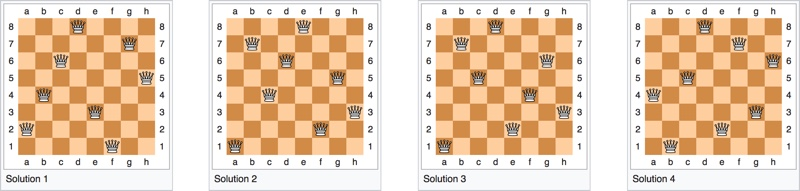

## Udacity - Artificial Intelligence Nanodegree - nd889

# Lab: Constraint Satisfaction N-Queens

This lab covers Constraint Satisfaction and Backtracking using a Symbolic representation to solve the N-Queens problem.



## What I learned
Modelling this problem in a representation like SymPy provided for an interesting insight into how to map a Constraint Satisfaction Problem (CSP) into a more generic structure where constraints are mathematical expressions and the variables being shared between assignments are easier to keep track of.

When modelled this way, additional optimizations can be made as discussed in the AIMA chapter on Constraint Satisfaction Problems.

## Instructions
```
$ jupyter notebook constraint_satisfaction.ipynb
```