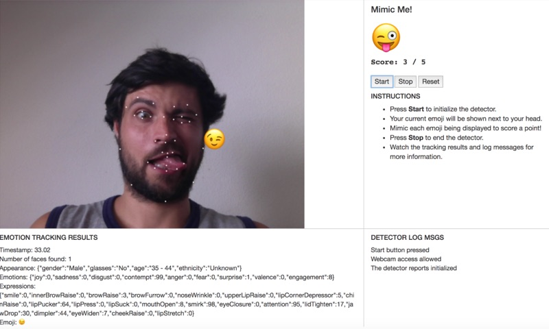

## Udacity - Artificial Intelligence Nanodegree - nd889

# Lab: Mimic Me!

For this Lab we were given the source to the Affectiva JS Demo SDK and asked to implement some simple Canvas code to draw points on various facial marker coords returned from the API.

In addition we were asked to implement a little game to utilize some other data returned from the API. The user is shown an emoji and asked to mimic it with their face. If they get it correct they get a point if they fail within 6 seconds a new random emoji is generated.

## Implementation

Several stub methods were provided which I needed to fill in. This included writing canvas code to draw little circles on each feature point, as well as code to draw an emoji next to one of the feature points.

The emojis are retuned from the API in unicode so drawing them via a font in canvas was really easy.

Finally I implemented the game mechanics as suggested in the source code by keeping some global variables for score and timers and hooking into the onImageResultsSuccess event listener to see if the emoji returned from the API for the current frame matched a randomly selected emoji. If the player is correct the game advances. A timer of 6 seconds keeps the game moving fast and fun.

JavaScript code here: [mimic.js](mimic.js)



## Serving locally over HTTPS

Generate a cert:
```
$ generate-pemfile.sh
```

This creates an SSL certificate file named my-ssl-cert.pem that is used to serve over https.

Now you can launch the server using:

```
$ python serve.py
```
