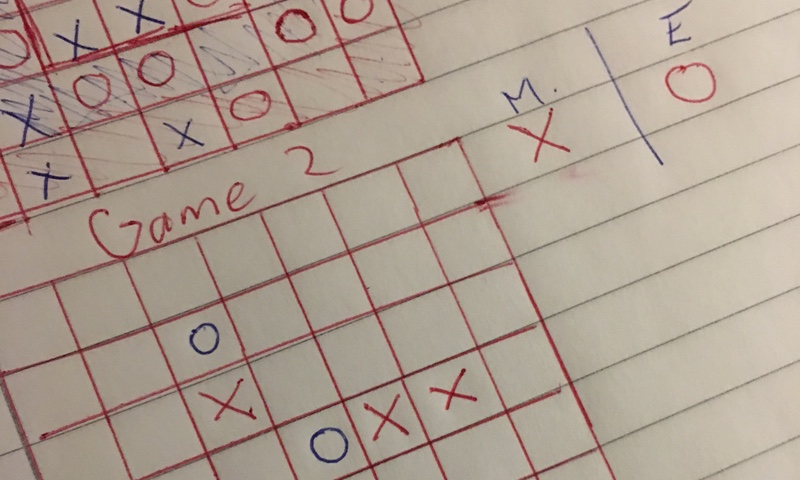

## Udacity - Artificial Intelligence Nanodegree - nd889

# Heuristics Analysis

After implementing the Minimax and Alpha-beta pruning algorithms we were challenged to create a series of heuristics which can out perform the ones supplied with the sample code.

The benchmark **improved_score** heuristic simply takes the number of available moves for both players and diffs them.

Since the game is a zero sum game and losing means having nowhere to move, it makes sense that the difference in available moves would be a valuable metric. However it turns out to be a very effective due to its simplicity.

The first few ideas I had were naive and attempted to manipulate combinations of the available game state properties or variations on **improved_score** using different weights.

None of these strategies provided any meaningful scores so I decided to take another approach.

I played a few matches and realized a few things about the game.

* The distance between squares is not what I expected, particularly when a player is in the corner

* The center of the board is quite different to the edges

* You can't win if you can't move, so ultimately having options to move is important

* Partitions can happen, but are hard due to the jumping nature of the knights but this could be something to explore

My first new heuristic was called **rush_middle** and it's goal was to increase the weighting of squares in the middle of the board. The intention was to include it with other heuristics.

After that, the next heuristic I made was called **build_wall** with the purpose of returning higher values if the current position is in the center row or column.

It was interesting that the basic heuristic of (players valid moves - opponents moves) was so effective, so I decided to play the game some more and consider the knights movement and the relationship between the distance from each square to the other squares on the board.

## Game Play

To help gaining insight by playing the game I made some adjustments to the board printing method to add the rows and columns, colors and to show the current valid moves; as well as showing which moves both players can move to.

Unfortunately, after many manual games I still couldn't find a reliable way to beat the AI.

<!--- PDF Formatting
 
 
-->
## More Heuristics

It seemed like blocking an opponent might be a good idea, so I tried a heuristic called **block_move** which checked if any of the available moves were also valid for the opponent.

I also considered a level past this called **clover_leaf** which checks if the move would block the opponent after their next valid move, which happens if you move to the diagonal square next to the other player. The diagonal squares form a kind of clover leaf hence the name.

While waiting for tournament runs I was doodling on paper and it occurred to me to draw out the distance from every square to every other square out of interest.

This lead me to the heuristic **plane_walker** which attempts to map out the distance to every square on the board which is reachable and blank.

This acts a little bit like a tree search except that each square is only considered once and the different distances can have varying values applied to them.

Interestingly I seem to be able to sometimes beat **improved_score** with a lower average depth which suggests that the heuristic is smarter but slower.

## Ensemble

I attempted to combine some of my heuristics into an ensemble, however manually tweaking weights for each heuristic was taking too long so I looked for an alternative solution.

## Genetic Algorithms

Hoping to improve some of my heuristics I wrote some genetic algorithm code to attempt to vary and mutate various weights for different heuristics in various combinations.

The code created a population of 100 chromosomes with random genes for each scoring function and weights affecting the multiplicative effect of each scoring function and then ran them against a modified version of the tournament where they only played an opponent with Alpha-beta pruning and **improved_score**.

After each generation the top scoring 45 were kept and cloned with a random chance of mutation, and 10 new random mutants were added to the population.

I ran various different versions of the code for several nights on a 16 core machine with python multiprocessing Pool, achieving a generation every minute. However the results never managed to approach the **improved_score**.

After later discovering the huge importance in the trade off between heuristic performance and tree search depth, it's probable this approach couldn't have worked as even chromosomes with weights ignoring a given gene would still evaluate the scoring function each time, thus slowing down the search and reducing the depth reached for every chromosome in the population. It was however a fun learning experience.

A version of the genetic algorithm code can be found in **pit.py**.

## Third Time Lucky

After speaking with some other students and adding code to determine the depth reached of the heuristic being run, it became quite clear that a winning heuristic would probably need to be extremely fast.

So based on some tips I retried some of my older ideas but with a focus on optimising their code, including inlining the default is_winner and is_loser methods to take advantage of of their variables in further calculations.

This resulted in writing **mov_pos_block** which adds the moves difference from **improved_score** with the difference in square value between the two players, where each square closer to the center has a higher value; and a bonus from **block_move**. To optimise the performance I wrote two methods to pre-generate dictionaries which I then added directly to the file.

Looking up the value of the player and their opponent's squares and seeing if the current move would block the opponent are both only a single operation. It's fast, but the result however were lacklustre.

Next up was **quick_center** an attempt to prefer moves in the center but in a very fast way. Unlike **rush_middle** this also compared the difference between both players, a factor which seems to be important in heuristics. This performed okay but again still not good enough to beat **improved_score**.

Finally **moves_ratio** which simply changes **improved_score** from a diff to a ratio actually seems to perform quite well.

## Performance

During development when a tweaked heuristic version would beat **improved_score** I would sometimes test it against NUM_MATCHES = 200, the result would always end up balancing out the advantage to nothing or negative.

Due the long wait time for big tournaments for final results I simply ran each heuristic with the default NUM_MATCHES = 5. Scores are tallied in the table below with links to the full detail text files.

Heuristic | ID | ID Depth | Student | Stu. Depth | Diff
-----------|-------|-------|---------|-------|----|
[rush_middle](stats/rush_middle.txt) | 78.57% | 12.34 | 73.57% | 12.74 | -5%
[build_wall](stats/build_wall.txt) | 75.71% | 12.38 | 61.43% | 11.50 | -14.28%
[block_move](stats/block_move.txt) | 80.71% | 12.17 | 64.29% | 11.37 | -16.42%
[clover_leaf](stats/clover_leaf.txt) | 80.71% | 12.18 | 61.43% | 11.34 | -19.28%
[plane_walker](stats/plane_walker.txt) | 77.14% | 12.31 | 75.71% | 10.19 | -1.43%
[ensemble](stats/ensemble.txt) | 80.71% | 12.20 | 72.86% | 9.27 | -7.85%
[mov_pos_blk](stats/mov_pos_block.txt) | 77.86% | 12.18 | 74.29% | 12.21 | -3.57%
[quick_center](stats/quick_center.txt) | 79.29% | 12.18 | 75.00% | 12.10 | -4.29%
[moves_ratio](stats/moves_ratio.txt) | 78.57% | 12.24 | 84.29% | 12.02 | 5.72%

## Results

I noticed there seemed to be a relationship between the average depth reached for a given heuristic and the performance of that heuristic.

This would make sense as too much time wasted in each evaluation over the entire iterative search could lessen the depth significantly.

Additionally, a really fast heuristic which provides no valuable information can perform poorly and even fail to reach deeper depths most likely due to Alpha-beta pruning failing to prune effectively.

My heuristics with lower average depth tended to perform worse than **improved_score** with deeper average depths.

Considering the poor performance of all my other heuristics it's no huge surprise that the best heuristic is essentially still based on the same metrics as the **improved_score**.

## Recommendations

I would recommend **move_ratio** because out of all the heuristics I developed it scores the highest and is particularly good against AB_Improved which is probably the best opponent in **tournament.py**. On large runs it seems to work about the same as **improved_score** but it can beat **improved_score** despite having a slightly shallower average depth.

## Future Ideas

For the future I would like to explore the relationship between the distances on the board and the available paths using a graph system, I think this might be much more efficient and provide some new interesting ways of viewing the problem, such as detecting and rewarding partitioning and calculating knights tours after partitioning.

I also think some of these simpler heuristics might be able to be combined together into an ensemble and optimal weights could be discovered using something like a genetic algorithm, however to keep the chromosomes competitive I would need to silence genes not being expressed so they don't slow down the evaluation.
