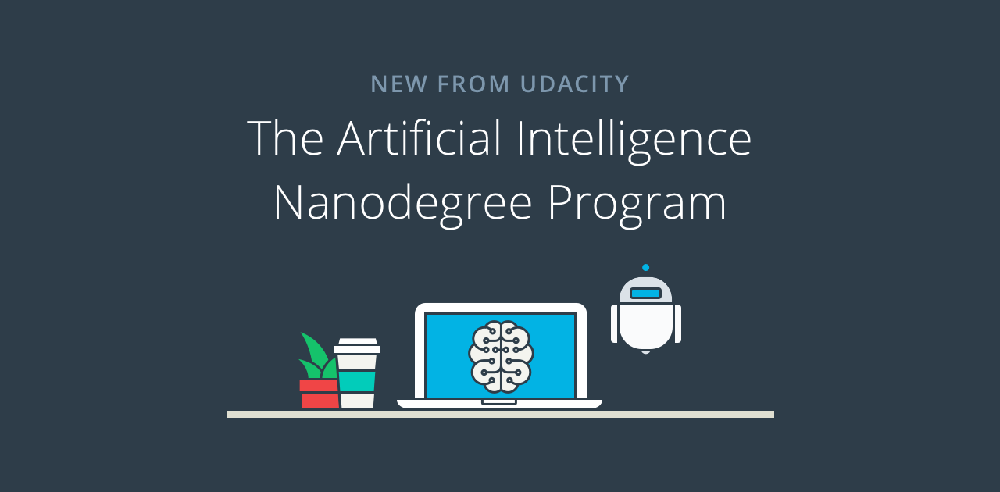

[](https://travis-ci.org/madhavajay/nd889)
[](http://twitter.com/madhavajay)

# Udacity - Artificial Intelligence Nanodegree - nd889



# Foundations of AI - Term 1
## Projects and Labs

1. [Solve a Sudoku with AI](1_foundations/1_sudoku/)
2. [Build a Game-Playing Agent](1_foundations/2_isolation/)
3. [Lab: Teaching Pac-Man to Search](1_foundations/3_pacman/)
4. [Lab: Simulated Annealing](1_foundations/4_simulated_annealing/)
5. [Lab: Constraint Satisfaction N-Queens](1_foundations/5_nqueens/)
6. [Implement a Planning Search](1_foundations/6_planning/)
7. [Build a Sign Language Recognizer](1_foundations/7_recognizer/)

# Deep Learning and Applications - Term 2
## Projects and Labs
1. MNIST
2. IMDB
3. CIFAR-10
4. [CNN Dog Breed Classifier](2_deep_learning/4_dog_breed_classifier/)
5. [RNN Apple Stock & Sherlock Holmes](2_deep_learning/5_rnn_stock_sherlock/)
6. [Lab: Affectiva SDK - Mimic Me!](2_deep_learning/6_cv_mimic_me/)

---

## Setup
This code uses the following:
- python 3.6
- [pylint](http://www.pylint.org) &amp; PEP 8 - Style Guide
- [mypy](http://mypy-lang.org) &amp; PEP 484 - Type Hints
- [pipenv](http://pipenv.org) &amp; PEP 508 - Dependency spec
- [pytest](http://pytest.org) - Tests

Install pipenv:
```bash
$ pip install pipenv
```

Change to project directory:
```bash
$ cd nd889
```

Initialize pipenv in python3 mode:
```bash
$ pipenv --three
```

Start pipenv shell
```bash
$ pipenv shell -c
```

Install project dependancies:
```bash
$ pipenv install
```

OpenCV 3:  
OpenCV 3 needs to be compiled with a bunch of extra stuff to access things like the webcam. If you want to skip this stuff you can simply run:
```bash
$ pipenv install opencv-python
```

Install Full Compiled OpenCV 3:
```bash
$ brew install opencv3 --with-contrib --with-python3 --without-python
```

Link OpenCV 3 to system site-packages:
```bash
$ echo /usr/local/opt/opencv3/lib/python3.6/site-packages >> /usr/local/lib/python3.6/site-packages/opencv3.pth
```

Link OpenCV to pipenv virtualenv:
```
$ ln -s /usr/local/opt/opencv3/lib/python3.6/site-packages/cv2.cpython-36m-darwin.so ~/.local/share/virtualenvs/nd889/lib/python3.6/cv2.so
```

## Tests
Run tests:
```bash
(nd889) $ pytest
```
